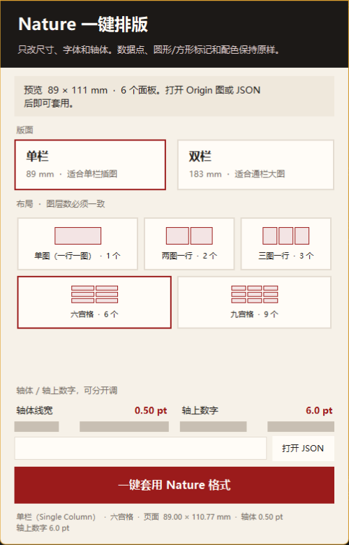

<p align="center">
  
</p>

# NatureFormat

**为已经组好的 Origin / OriginPro 图件统一页面尺寸、面板布局、字体和坐标轴。**

An Origin App and Python tool for formatting assembled figures. The layout operation preserves data values, marker shapes, curve colors, and axis-title wording.

[安装到 Origin](#在-origin-pro-里用) · [直接打开界面](#先看界面不经过画廊) · [命令行示例](#命令行--开发) · [六面板输入示例](examples/assembled_six_panel.json)



<picture>
  <source media="(max-width: 600px)" srcset="assets/readme/diagrams/workflow-readme-md-1-mobile.svg">
  
</picture>

<sub>[Editable diagram source / 可编辑图源](assets/readme/diagrams/workflow-readme-md-1.mmd)</sub>

先完成数据作图和面板组装，再应用排版。单栏为 89 mm，双栏为 183 mm；参数和可修改范围见下表。项目为独立工具，使用者仍需核对目标期刊的现行图件要求。

## 功能

| 会改 | 不改 |
| --- | --- |
| 单栏 89 mm / 双栏 183 mm，高 ≤ 247 mm | 数据点 x、y |
| 各面板位置和大小 | 圆形、方形等标记 |
| 标题、注释、轴上数字 → Arial 5–7 pt | 曲线颜色 |
| 多图 `a, b, c…`：8 pt 粗体正体小写 | 轴标题文字 |
| 轴体 / 刻度 0.25–1 pt | |

六宫格：单栏 3×2，双栏 2×3。轴体和轴上数字可分开拖。顶部会显示当前图有几个图层；对不上会直接说，不会偷偷少排。

## 在 Origin Pro 里用

1. 双击 `安装到Origin.bat`（复制到 `%LOCALAPPDATA%\OriginLab\Apps\NatureFormat`）
2. 打开 Origin Pro，点选一张**已经组好**的图（几个图层 = 几个面板）
3. 脚本窗口运行：

```labtalk
run -pyf "%@ANatureFormat\open_app.py";
```

或在 **代码生成器** 里把 `NatureFormat` 文件夹加成 App，Generate 成 `.opx`，拖进 Origin，之后就可以点右侧 **Apps 画廊** 里的图标。

Apps 画廊里图标只在 **Graph 窗口** 激活时可用。

## 先看界面（不经过画廊）

在仓库根目录：

```powershell
cd path\to\NatureFormat
py -3 -m natureformat ui
```

或双击 `启动Nature排版.bat`。Origin 开着时，同一套界面会套用到**当前图**。

## 命令行 / 开发

```powershell
py -3 -m pip install -e ".[test]"
py -3 -m natureformat apply --column 单栏 --layout 六宫格 examples\assembled_six_panel.json
py -3 -m pytest
```

Python **3.10+**（见 `pyproject.toml`）。包名：`natureformat` v0.1.0。

## 科学 / 使用边界 — 它不是什么

- **不是** Origin 安装程序，也不是替你画数据或改曲线样式的绘图引擎
- **不是** 自动排版论文全文（LaTeX / Word）；只服务 **已组好的 Graph**
- 不会改数据、标记形状或配色——需要改样式时请在 Origin 里手动调整后再套用尺寸

## 许可

仓库未附独立 LICENSE 文件；使用前请以仓库声明为准。作者：D-sudoasd。
